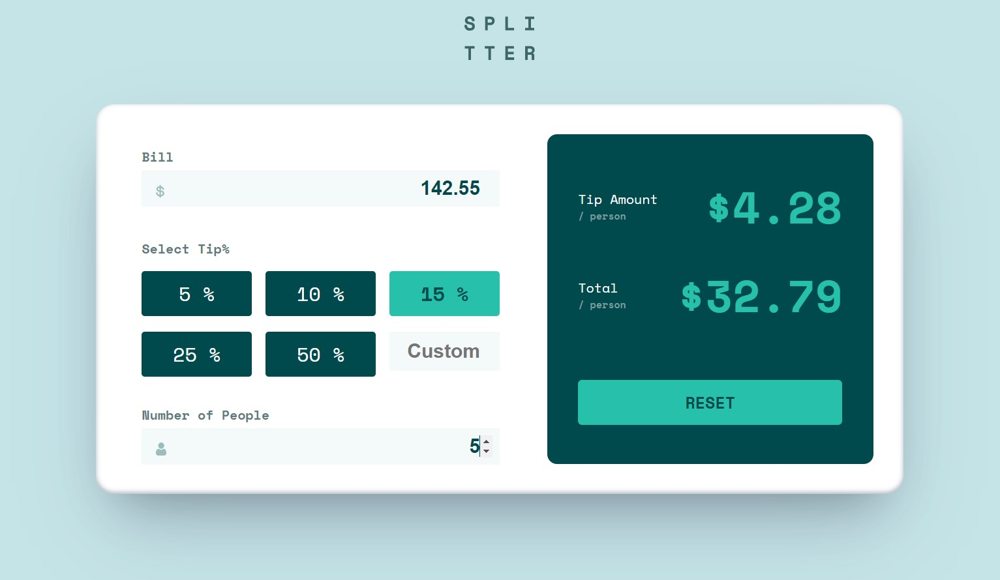

# Frontend Mentor - Tip calculator app solution

This is a solution to the [Tip calculator app challenge on Frontend Mentor](https://www.frontendmentor.io/challenges/tip-calculator-app-ugJNGbJUX). Frontend Mentor challenges help you improve your coding skills by building realistic projects.

## Table of contents

- [Overview](#overview)
  - [The challenge](#the-challenge)
  - [Screenshot](#screenshot)
  - [Links](#links)
- [My process](#my-process)
  - [Built with](#built-with)
  - [What I learned](#what-i-learned)
  - [Continued development](#continued-development)
  - [Useful resources](#useful-resources)
- [Author](#author)
- [Acknowledgments](#acknowledgments)


## Overview

### The challenge

Users should be able to:

- View the optimal layout for the app depending on their device's screen size
- See hover states for all interactive elements on the page
- Calculate the correct tip and total cost of the bill per person

### Screenshot




### Links

- Solution URL: Pending
- Live Site URL: Pending

## My process

### Built with

- Semantic HTML5 markup
- CSS custom properties
- Flexbox
- CSS Grid
- Mobile-first workflow
- [React](https://reactjs.org/) - JS library
- [Vite](https://vitejs.dev/) - Frontend dev tool

### What I learned

A programming challenge was to select the tip rates by clicking on colored divs. Then the active div had a color different than the rest.

First, used an activeIndex as a state variable, as below.

```js
const Tips = ({ setThisTipRate }) => {
  const tipRates = ["5", "10", "15", "25", "50"];
  const initialActiveIndex = tipRates.indexOf("15");
  const [activeIndex, setActiveIndex] = useState(initialActiveIndex);
  const [customTip, setCustomTip] = useState("");

  const handleClick = (index) => {
    setCustomTip("");
    setActiveIndex(index);
  };
```

Then, an onClick action for turning the selected element to active, and removing the active status from any other element.

```html
 return (
    <>
      {tipRates.map((tipRate, index) => (
        <div
          key={index}
          className={index === activeIndex ? "tips active" : "tips"}
          onClick={() => handleClick(index)}
        >
          {tipRate} %
        </div>
      ))}
```


### Continued development


Continue improving my coding skills by developing challenging applications, like this one.

### Useful resources

- [Video tutorial](https://www.youtube.com/watch?v=etYv-pPfol4) - It is this challenge developed in vanilla Javascript. Some ideas taken from here, regarding CSS styling.

- ChatGPT. Suggested the code snippet above, using the activeIndex.


## Author

- Website - [Guillermo Dominguez](https://gdominguez-portfolio.netlify.app)
- Frontend Mentor - [@memominguez](https://www.frontendmentor.io/profile/memominguez)


## Acknowledgments

Thanks to all those who share their knowledge, free of charge, through video tutorials in the youtube platform.

Also thanks to the creators and sponsors of ChatGPT. 

